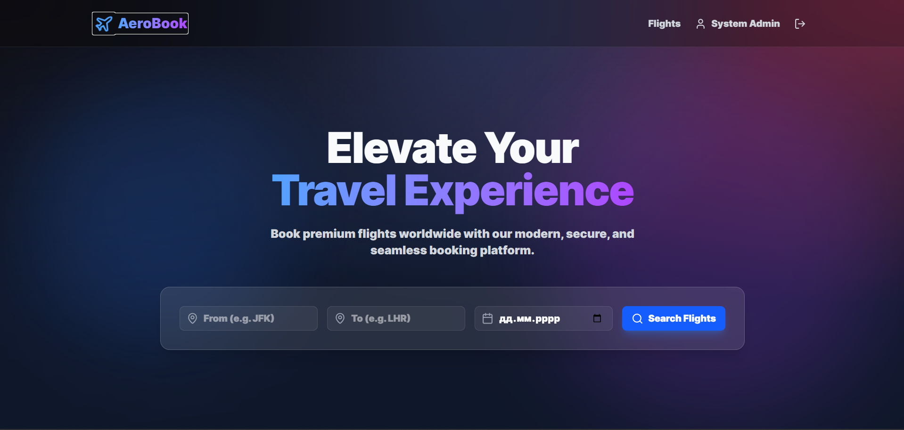
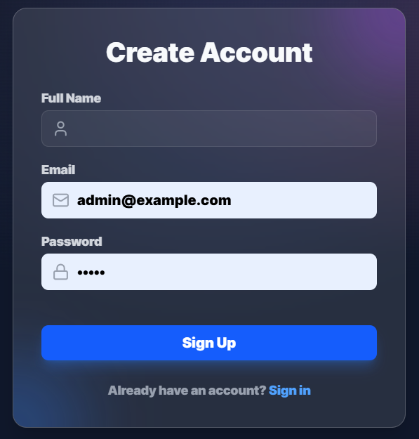
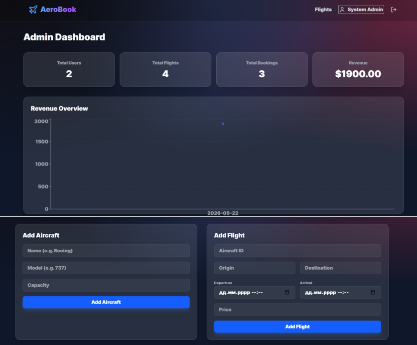
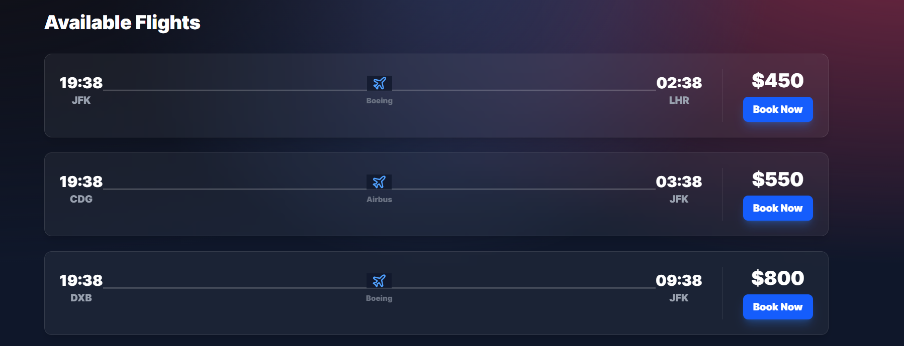

# Ticket Booking  System (AeroBook)

## Назва
**AeroBook** — це комплексна SaaS-платформа (CRM/ERP система), розроблена для автоматизації
процесів бронювання авіаквитків, управління авіарейсами, пасажиропотоком та фінансовою звітністю.
Система орієнтована на використання авіакомпаніями, логістичними диспетчерами та туристичними
агентствами для оптимізації внутрішніх операцій та покращення клієнтського досвіду..

## УРЛ
**Live URL:** [https://web-lepak-q8rm.vercel.app/](https://web-lepak-q8rm.vercel.app/)

## Функції
Система забезпечує повний цикл управління сервісним центром:
AeroBook , адаптація під специфіку авіаквитків, декоративна система спрощена (тільки Адміністратор та Клієнт), а також змінено логіку фінансового обліку та додано бронювання місць:

Управління бронюванням та рейсами: створення, скасування та зміна рейсів, відстеження статусів замовлень (від "Очікує оплата" до "Посадка завершена"), швидкий пошук квітків за номером або даними пасажира.

Бронювання місць та вибір класів: Інтерактивний вибір у особливий спосіб, так само як у вітальні (біля) вікна, біля проходу), поділ квітків за класами обслуговування (Економ, Бізнес, Перший клас) та керування додатковим багажем.

База пасажирів та історія подорожей: Збереження профілів клієнтів (ПІБ, паспортні дані, контакти), облік накопичених бонусних миль за програмою лояльності та збереження повної історії перельотів horse-riding passenger.

Фінансовий облік (Дохід з продажу): Фіксація оплати за квитки та додаткові послуги (багаж, харчування), моніторинг чистого доходу від продажів, автоматичний, розрахунковий, виплата повернення коштів (Refunds) та статистика за типами платежів (картка, безготівковий розрахунок, бонуси).

Зведена система доставки: Читке розмежування прав між двома ролями:

Адміністратор: Має повний доступ до управління рейсами, флотом літаків, ціноутворенням, перегляду загальної фінансової аналітики та доходів компанії.

Клієнт (Пасажир): Має доступ до пошуку рейсів, бронювання квітків, вибору місць та перегляду історії лише власних mid-morning у власному таксі.

## Авторизація
**Сторінка авторизації:** [https://repair-shop-client.vercel.app/login](https://repair-shop-client.vercel.app/login) (або `/login`)
**Сторінка реєстрації (для клієнтів):** `/register`

Система використовує JWT токени (Access та Refresh) для захисту сесій.

### Ролі та доступ:
1. **Admin (Адміністратор):** Має повний доступ до всіх функцій додавання рейсів, літаків, замовляти квитки.
   - **Логін:** `admin@example.com`
   - **Пароль:** `Admin`

2. **Client (Клієнт):** Може переглядати лише власні квитки та їх статус.
   - **Логін:** `john1@example.com` (тестовий клієнт з бази)
   - **Пароль:** `john`
   - *Примітка:* Клієнт також може створити свій обліковий запис самостійно на сторінці `/register`.

---

## Сторінки проекту

### 1. Головна сторінка (Landing Page)
- **Опис:** Публічна сторінка, яка презентує пошук авіаквитків.
- **Скріншот:**
  

### 2. Авторизація / Реєстрація
- **Опис:** Форми для входу в систему та реєстрації нових клієнтів.
- **Скріншот:**
  

### 3. Дашборд (Dashboard)
- **Опис:** Аналітична панель для адміністраторів. Відображає ключові показники та можливі функції.
- **Скріншот:**
  

### 4. Бронювання (Orders)
- **Опис:** Таблиця зі списком усіх ремонтів. Дозволяє фільтрувати замовлення, змінювати статуси та створювати нові заявки.
- **Скріншот:**
  

### 5. Деталі Бронювання (Order Details)
- **Опис:** Детальне зображення системи вибору посадочного місця та бронювання.
- **Скріншот:**
  

